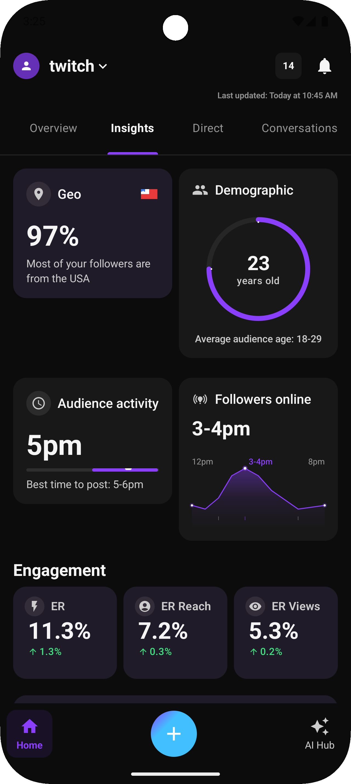

# Twitch Insights Analytics UI

A modern, polished analytics dashboard UI built with Jetpack Compose, featuring a dark theme and beautiful data visualizations.

## Features

### 1. Modern Dark Theme UI
- Custom dark theme with proper color hierarchy
- Consistent elevation and depth
- Subtle gradients and polished surfaces

### 2. Interactive Data Visualizations
- **Demographic Donut Chart**: Beautiful gradient-colored donut chart showing user demographics with gender breakdown
- **Followers Online Line Graph**: Interactive line chart with gradient fill showing peak follower activity times
- **Audience Activity Indicators**: Visual time sliders showing optimal posting times
- **Engagement Metrics**: Cleanly displayed performance metrics with trend indicators

### 3. Custom Components
- **Bottom Navigation Bar**: Custom bottom navigation with rounded corners and stylish selection indicators
- **Tab Navigation**: Custom tab implementation with Material Design 3 styling
- **Cards and Surfaces**: Consistent card design with proper elevation and spacing
- **Custom Icons**: Well-designed icon suite for metrics and navigation

### 4. Edge-to-Edge Design
- Full edge-to-edge content display
- Proper handling of system UI insets
- Transparent system bars with proper icon coloring

### 5. Responsive Layout
- Grid-based card layout for optimal information density
- Responsive padding and spacing
- Proper vertical scrolling for all content

## Implementation Details

The project uses:
- **Jetpack Compose**: Modern declarative UI toolkit
- **Material 3**: Latest Material Design components and theming
- **Custom Canvas Drawing**: Hand-crafted visualizations for charts and graphs
- **Edge-to-Edge UI**: Full-screen immersive experience
- **Kotlin**: 100% Kotlin implementation

## Getting Started

1. Clone the repository
2. Open in Android Studio
3. Sync Gradle files
4. Run on a device or emulator

## Structure

- `ui/theme/`: Custom theme implementation (colors, typography, shapes)
- `ui/insights/`: Main analytics UI implementation
  - `InsightsScreen.kt`: Main screen structure and layout
  - `InsightsComposables.kt`: Individual UI components and cards

## Customization

You can easily customize:
- Color scheme in `Color.kt`
- Typography and text styles in `Type.kt`
- Card shapes and corner radii in `Shape.kt`
- Chart data in individual card implementations

## License

This project is available under the MIT License. See the LICENSE file for more details. 